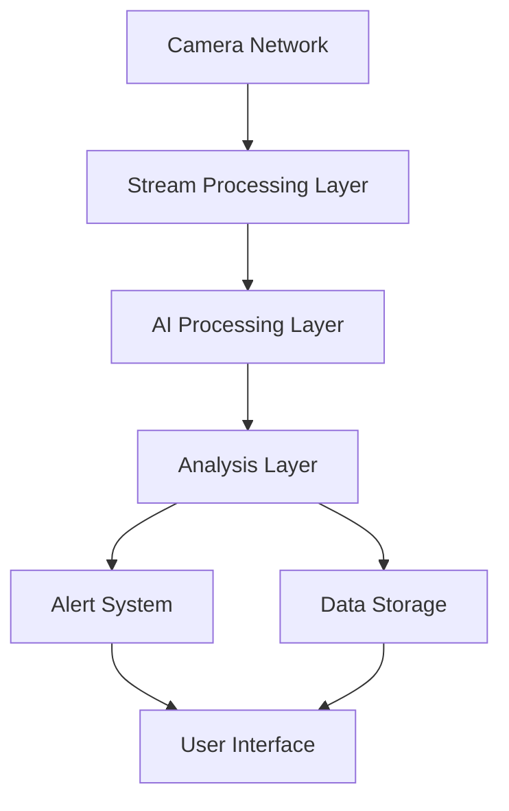
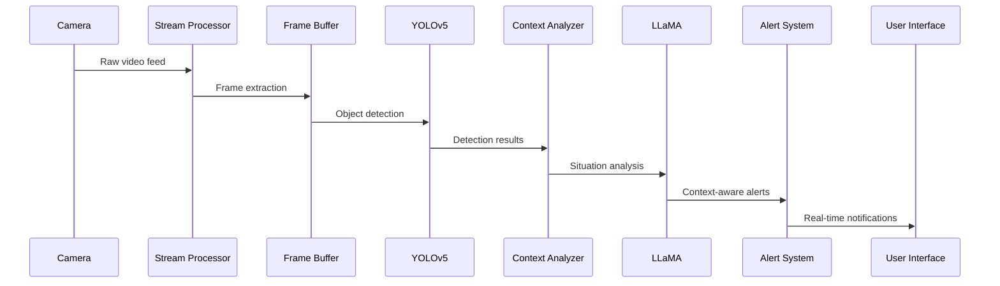

# SALAMA Technical Documentation

## 1. Project Overview

### 1.1 Introduction
SALAMA (Safety Assurance with Live AI Monitoring & Alerts) is an advanced railway safety system that leverages cutting-edge AI technologies to transform standard surveillance cameras into intelligent safety monitoring devices. The system combines real-time object detection with contextual understanding to provide proactive safety measures in railway environments.

### 1.2 Core Objectives
1. **Enhanced Safety Monitoring**
   - Real-time threat detection
   - Proactive alert generation
   - Contextual situation analysis
   - Multi-camera coordination

2. **Operational Efficiency**
   - Automated monitoring
   - Reduced response times
   - Resource optimization
   - Incident prevention

3. **System Intelligence**
   - AI-powered detection
   - Context-aware analysis
   - Learning capabilities
   - Predictive insights

### 1.3 Key Features
```typescript
interface CoreFeatures {
  realTimeMonitoring: {
    videoProcessing: "Multi-stream processing",
    objectDetection: "YOLOv5 implementation",
    contextAnalysis: "LLaMA integration",
    alertGeneration: "Intelligent threat assessment"
  },
  
  safetyFeatures: {
    platformEdgeMonitoring: "Person detection near edges",
    trackObstruction: "Object detection on tracks",
    unauthorizedAccess: "Restricted area monitoring",
    crowdAnalysis: "Density and flow monitoring"
  },
  
  systemCapabilities: {
    multiCameraSupport: "Scalable camera management",
    realTimeAlerts: "Instant notification system",
    dataAnalytics: "Performance and incident analysis",
    aiAssistance: "Context-aware decision support"
  }
}
```

## 2. System Architecture

### 2.1 High-Level Architecture


### 2.2 Infrastructure Components

#### 2.2.1 Physical Infrastructure
```yaml
Servers:
  Application:
    Type: "AIME A4000 2U Rack Server"
    CPU: "AMD EPYC 7443 (24 cores)"
    GPU: "2x NVIDIA L40S"
    RAM: "256GB ECC"
    Storage: "2x 8TB NVMe"
    Network: "10GbE + redundancy"

  Database:
    Type: "Dedicated Database Server"
    Storage: "RAID 10 Configuration"
    Backup: "Real-time replication"

Network:
  Primary: "10GbE Backbone"
  Redundancy: "Dual network paths"
  Security: "Network segregation"
```

#### 2.2.2 Logical Architecture
```typescript
interface SystemLayers {
  presentation: {
    web: "Next.js 14 Application",
    desktop: "Electron Application",
    mobile: "React Native Application"
  },
  
  application: {
    api: "FastAPI Backend",
    websocket: "Real-time communication",
    taskQueue: "Background processing"
  },
  
  processing: {
    videoProcessing: "GPU-accelerated",
    aiModels: "YOLOv5 + LLaMA",
    analysis: "Context processing"
  },
  
  storage: {
    primary: "PostgreSQL + TimescaleDB",
    cache: "Redis",
    fileStorage: "MinIO"
  }
}
```

### 2.3 Data Flow

#### 2.3.1 Video Processing Pipeline


#### 2.3.2 Alert Generation Flow
```typescript
interface AlertFlow {
  detection: {
    input: "Raw camera feed",
    processing: "YOLOv5 detection",
    output: "Detection coordinates and confidence"
  },
  
  analysis: {
    input: "Detection results",
    processing: "LLaMA context analysis",
    output: "Situation assessment"
  },
  
  alertGeneration: {
    evaluation: "Threat level assessment",
    classification: "Alert type determination",
    notification: "Multi-channel alert distribution"
  }
}
```

## 3. Technology Stack Overview

### 3.1 Development Philosophy
```typescript
interface DevelopmentPrinciples {
  modern: "Latest stable technologies",
  scalable: "Horizontal and vertical scaling",
  maintainable: "Clean architecture and documentation",
  reliable: "Robust error handling and monitoring",
  secure: "Security-first approach"
}
```

### 3.2 Core Technologies
```yaml
Frontend:
  Framework: "Next.js 14"
  State Management: "Zustand"
  Real-time: "Socket.io-client"
  UI Components: "shadcn/ui"
  Styling: "Tailwind CSS"
  Charts: "Recharts"
  Type Safety: "TypeScript"

Backend:
  Framework: "FastAPI"
  AI Processing: "PyTorch, OpenCV"
  Queue System: "Celery with Redis"
  WebSockets: "FastAPI WebSockets"
  API Documentation: "OpenAPI (Swagger)"

Database:
  Primary: "PostgreSQL 16 + TimescaleDB"
  Cache: "Redis"
  Search: "Meilisearch"
  Object Storage: "MinIO"

DevOps:
  Containerization: "Docker"
  Orchestration: "Kubernetes"
  CI/CD: "GitHub Actions"
  Monitoring: "Grafana + Prometheus"
  Logging: "ELK Stack"
```

[Continue to Part 2: Technical Implementation Details...]